# Three-Way Match Engine

A backend API to upload PO, GRN, and Invoice PDFs, extract their data using Gemini AI, and perform a three-way match to check for discrepancies.

## Tech Stack
- Node.js / Express
- MongoDB (Mongoose)
- Gemini 3.1 Flash Lite API
- Multer (for file uploads)

## Setup
```bash
npm install
# Create a .env file (see .env.example) with your MONGODB_URI and GEMINI_API_KEY
npm run dev
```

---

## Workflow Approach
<p align="center">
  
</p>
Instead of creating a separate database table to store "Match Results" and trying to update it every time a file comes in, I decided to make the matching **stateless**. 

When you ask for the match status of a PO number, the code just looks at whatever documents exist in the database *at that exact moment*, does the math, and returns the answer. This made the code much simpler and completely solved the out-of-order upload problem without needing complex background jobs.

## Data Model
I kept the database very simple with just one collection called `documents`. 
- Every document (PO, GRN, or Invoice) is saved here.
- They are linked together using the `poNumber` field.
- The actual extracted JSON is stored inside a `parsedData` object.
- I added a `parseStatus` field (`success`/`failed`) so I know if Gemini actually understood the PDF.

## Parsing Flow
1. User uploads a PDF via the `/upload` endpoint.
2. Multer saves the file temporarily.
3. I convert the PDF to base64 and send it to Gemini with a prompt asking for specific JSON fields.
4. Gemini sometimes wraps the JSON in markdown tags (```json), so I wrote a small script to strip those out before parsing.
5. **AI Typo Fix:** I noticed Gemini sometimes misreads letters as numbers (like reading `CI4PO...` as `CI4P00...`). So, when a PO is uploaded, the code runs a quick Regex check to auto-correct any slightly misspelled PO numbers on previously uploaded GRNs/Invoices.
6. The parsed JSON is saved to MongoDB, and the temp file is deleted.

## Matching Logic

**Item Matching Key:**
I used the `itemCode` (SKU) as the primary matching key. However, I quickly realized the Invoice PDF uses completely different internal codes (like `FG-P-F-0503`) compared to the PO/GRN (which use `11423`). 

To fix this, I used a **two-step matching strategy**:
1. Try to match exactly by `itemCode`.
2. If that fails, normalize the item descriptions (make them lowercase, remove punctuation) and check if the first 8 characters of the shorter description match the longer one. (e.g., "chickenmomos24" matches "chickenmomos24.0pieces"). This successfully links the Invoice items to the PO items.

**Rules Checked (at the item level):**
1. GRN received quantity ≤ PO quantity
2. Invoice quantity ≤ PO quantity
3. Invoice quantity ≤ Total GRN quantity
4. Invoice date ≤ PO date

## How I Handled Out-of-Order Uploads
Because the matching logic doesn't rely on saved states, upload order doesn't matter at all. 
* If an Invoice is uploaded first, the database just saves it. 
* When you call `GET /match/:poNumber`, it sees the Invoice, realizes the PO and GRN are missing, and returns `insufficient_documents` with the exact reasons (`["po_not_uploaded", "missing_grn"]`).
* When the PO and GRN arrive later, the next match request automatically calculates the real result.

## Assumptions
- There will only be one PO per `poNumber` (multiple POs trigger a `duplicate_po` error).
- Partial deliveries are normal (e.g., GRN receives 30 out of 120 ordered). This triggers a `partially_matched` status, not an error.
- The dates extracted by AI will be in a format that JavaScript's `new Date()` can understand.

## Tradeoffs
- **Relying on AI Vision:** The biggest tradeoff is that my matching logic is only as good as the data Gemini extracts. If the AI accidentally reads the wrong column in a messy PDF table (e.g., reading "Expected Qty" instead of "Invoiced Qty"), my code will correctly flag a quantity mismatch, even if the physical documents are fine.
- **Fuzzy Matching Limitations:** My 8-character string matching works well for these documents, but if two totally different items happen to have very similar first 8 characters, it might match the wrong rows.

## What I Would Improve With More Time
- **Better Item Matching:** Instead of guessing based on description strings, I would ask the company for a master SKU mapping table to get 100% accurate matches.
- **Caching:** Right now, the database is queried every time you check the match status. For a high-traffic app, I would cache the result in Redis and only recalculate it when a new document is uploaded.
- **Unit Tests:** I would write tests specifically for the fuzzy string matcher to make sure it handles edge cases.

---

## API Usage Examples
A Postman collection is included in the repo (`Three-Way Match Engine API.postman_collection.json`).

**1. Upload Document**
`POST /documents/upload`
- Body: form-data (`file`: the PDF, `documentType`: "po", "grn", or "invoice")

**2. Get Parsed Document**
`GET /documents/:id`

**3. Get Match Result**
`GET /match/:poNumber`

---

## Example Outputs

### 1. Sample Parsed JSON (from GET /documents/:id)
```json
{
  "documentType": "po",
  "poNumber": "CI4PO05788",
  "parseStatus": "success",
  "parsedData": {
    "poNumber": "CI4PO05788",
    "poDate": "2026-03-17",
    "vendorName": "M/s AFP",
    "items": [
      {
        "itemCode": "11423",
        "description": "Cheesy Spicy Veg Momos 24.0 Pieces",
        "quantity": 50,
        "unitPrice": 220.76
      }
    ]
  }
}
```

### 2. Sample Match Result (Out of order: Invoice arrived first)
```json
{
  "poNumber": "CI4PO05788",
  "status": "insufficient_documents",
  "reasons": [
    "po_not_uploaded",
    "missing_grn"
  ],
  "linkedDocuments": {
    "po": null,
    "grns": [],
    "invoices": [
      {
        "id": "665a1b2c3d4e5f6a7b8c9d1e",
        "number": "IN25MH2504251"
      }
    ]
  }
}
```

### 3. Sample Match Result (Final Mismatch)
*Note: In the provided sample PDFs, the Invoice date (March 24) is after the PO date (March 17), which correctly triggers a mismatch.*
```json
{
  "poNumber": "CI4PO05788",
  "status": "mismatch",
  "reasons": [
    "invoice_date_after_po_date"
  ],
  "linkedDocuments": {
    "po": {
      "id": "665a1b2c3d4e5f6a7b8c9d0e",
      "number": "CI4PO05788"
    },
    "grns": [
      {
        "id": "665a1b2c3d4e5f6a7b8c9d2e",
        "number": "CI4000020234"
      }
    ],
    "invoices": [
      {
        "id": "665a1b2c3d4e5f6a7b8c9d1e",
        "number": "IN25MH2504251"
      }
    ]
  }
}
```

### 4. Sample Match Result (Partial Delivery)
```json
{
  "poNumber": "CI4PO05788",
  "status": "partially_matched",
  "reasons": [
    "partial_grn_delivery"
  ],
  "linkedDocuments": {
    "po": { "id": "...", "number": "CI4PO05788" },
    "grns": [{ "id": "...", "number": "CI4000020234" }],
    "invoices": [{ "id": "...", "number": "IN25MH2504251" }]
  }
}
```
